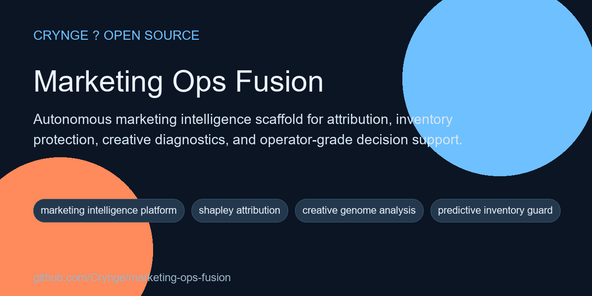

# Marketing Ops Fusion

<!-- portfolio-seo:start -->
  



> Autonomous marketing intelligence scaffold for attribution, inventory protection, creative diagnostics, and operator-grade decision support.

**GitHub Search Keywords:** marketing intelligence platform, shapley attribution, creative genome analysis, predictive inventory guard, revops ai, marketing ops automation

<!-- portfolio-seo:end -->

<!-- portfolio-links:start -->
<div align="center">

[Documentation](docs) &middot; [Architecture](docs/architecture.md) &middot; [Authors](AUTHORS.md) &middot; [Contributing](CONTRIBUTING.md) &middot; [Security](SECURITY.md) &middot; [Workflows](.github/workflows)

</div>
<!-- portfolio-links:end -->

An autonomous marketing intelligence scaffold for teams that need one operating layer across **attribution**, **inventory risk**, **creative performance**, and **cross-channel decision support**.

## Why This Repo Exists

Modern marketing teams often have the data, but not the operating system. Spend is split across platforms, attribution remains contested, inventory surprises kill profitable campaigns, and creative learnings rarely feed back into planning fast enough. Marketing Ops Fusion is shaped as a technical foundation for solving that class of problem.

## Core Concepts

- **Shapley attribution** for fairer channel credit allocation
- **Predictive inventory guard** to reduce stockout-driven wasted spend
- **Creative genome analysis** for repeatable learning from winning assets
- **Self-healing connector logic** for rate limits, retries, and degraded vendors
- **Agent-specialist architecture** across growth, creative, SEO, and risk

## Current Repository Status

This repository is a strong technical scaffold with configuration, connectors, docs, tests, and Python package structure in place. It should be treated as an advanced foundation rather than a fully production-complete platform.

## Repository Layout

- `src/core/` - event bus and state-management primitives
- `src/agents/` - specialist agent modules
- `src/connectors/` - external marketing system integrations
- `src/models/` - data and contract layers
- `config/` - strategies, thresholds, and compliance rules
- `docs/` - technical documentation
- `tests/` - smoke and regression coverage

## Quick Start

```bash
python -m pip install -r requirements.txt
python -m compileall src tests
```

## Recommended Next Expansion

- flesh out connector implementations
- add import/export contracts for real marketing platforms
- add scenario datasets and benchmark fixtures
- expand test coverage around attribution and inventory logic
